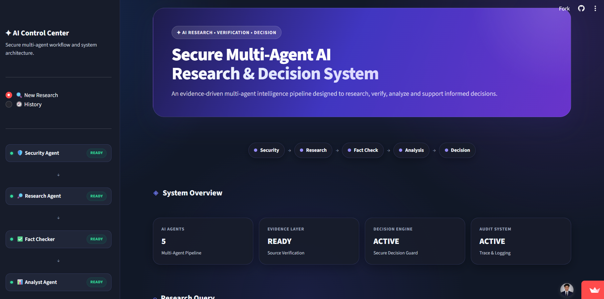
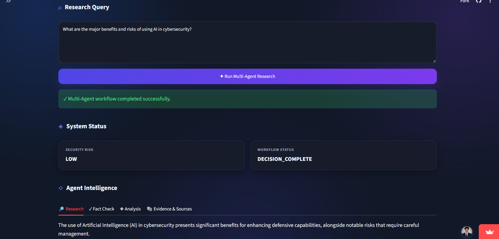
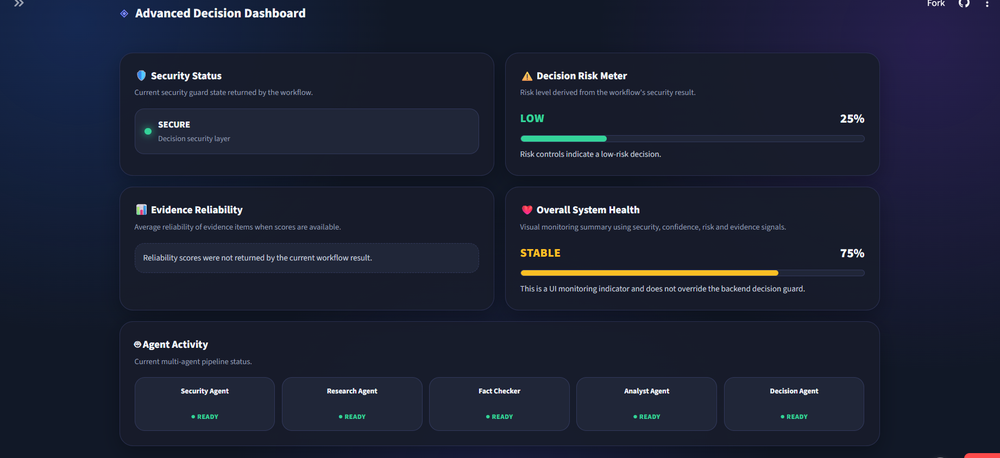
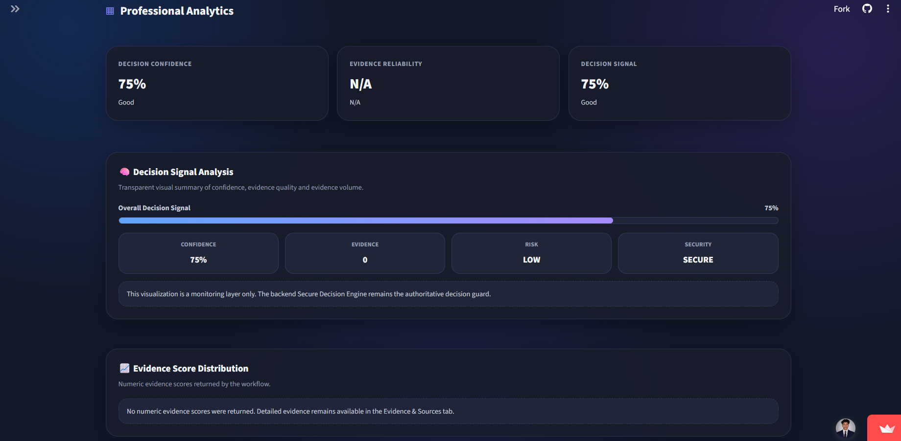
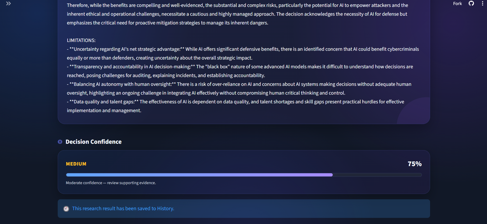

# Secure Multi-Agent AI Research & Decision System

An AI research and decision-support project designed around a modular, multi-agent architecture. The repository separates research, agent coordination, evidence handling, security checks, decision logic, and workflow orchestration so each part can be developed and tested independently.

<!-- Add your actual deployment and repository URLs below. -->
## 🔗 Project Links

- **Live Demo (Streamlit Cloud):** [https://secure-multi-agent-ai-research-decision-system-cqqj2faeabjeapp.streamlit.app/]
- **GitHub Repository:** [https://shitsukendu.github.io/secure-multi-agent-ai-research-decision-system/]

---

## 📸 Screenshots

> Add your four application screenshots in the spaces below. You can upload the images to a folder such as `assets/screenshots/` and replace each placeholder with a Markdown image link.

### Screenshot 1 — Main Application



### Screenshot 2 — Research / Agent Workflow



### Screenshot 3 — Advance Decision Dashboard



### Screenshot 4 — Professional Analytics



### Screenshot 5 — Decision / Final Output



---

## 📖 Overview

The **Secure Multi-Agent AI Research & Decision System** is a modular project for organizing an AI-assisted research process into distinct stages. Instead of placing every responsibility in one large module, the codebase separates agent logic, coordination, research tasks, evidence processing, security-related checks, decision support, and workflow execution.

The intended high-level process is:

1. **Receive a task** — accept a research question or decision-support request through the application or entry point.
2. **Prepare the workflow** — organize the request into the steps required for research and analysis.
3. **Coordinate agents** — use the coordination layer to manage the relevant agent activities.
4. **Research the topic** — run the research components needed to gather information for the task.
5. **Handle evidence** — organize available evidence and its associated source information for later review.
6. **Apply security checks** — route information through the project's security-related components where configured.
7. **Support a decision** — pass the gathered information to the decision layer for structured analysis or recommendations.
8. **Return the result** — present the resulting output through the relevant application or command-line entry point.
9. **Test and improve** — use the test modules to check individual components and refine the workflow.

> The exact behavior of each stage depends on the implementation and configuration in the repository. This overview describes the project's modular design and intended flow; it does not imply that every external integration or security control is enabled by default.

## 🎯 Project Goals

- Organize AI-assisted research as a sequence of manageable stages.
- Separate agent responsibilities from coordination and workflow orchestration.
- Keep evidence handling distinct from research and decision-support logic.
- Provide a dedicated place for security-related components.
- Make individual modules easier to maintain, test, and extend.
- Create a foundation for traceable research and structured decision support.

## 🧩 Project Structure

The repository is organized into the following main areas:

```text
Secure-Multi-Agent-AI-Research-and-Decision-System/
├── agents/          # Agent implementations and task-specific behavior
├── coordination/    # Coordination between agents or workflow stages
├── core/            # Shared core utilities and foundational logic
├── decision/        # Decision-support and analysis components
├── evidence/        # Evidence-related processing and storage logic
├── research/        # Research and information-gathering components
├── security/        # Security-related checks and controls
├── tests/           # Tests grouped in a dedicated directory
├── workflow/        # Workflow orchestration and execution logic
├── app.py           # Application interface / application entry point
├── main.py          # Main execution entry point
├── pyproject.toml   # Project and tool configuration
├── requirements.txt # Python dependency list
├── uv.lock          # Locked dependency versions for uv
├── .gitignore       # Files and folders excluded from Git
└── README.md        # Project documentation
```

The repository may also contain root-level `test_*.py` files for specific components. The tree above highlights the main folders and files; it is not intended to list every module.

## ⚙️ How the System Works

### 1. Request and entry point

The process begins from the application interface (`app.py`) or the main execution entry point (`main.py`), depending on how you run the project. These files provide the starting point for invoking the system.

### 2. Workflow orchestration

The `workflow/` layer represents the sequence of steps used to carry a task through the system. Keeping orchestration separate makes it easier to change the order of stages without combining all responsibilities into one file.

### 3. Agent execution and coordination

The `agents/` directory contains agent-related logic. The `coordination/` directory is responsible for the coordination layer. Together, these areas provide the structure for dividing work into separate responsibilities and managing how those responsibilities fit into the broader process.

### 4. Research and information gathering

The `research/` directory contains research-oriented components. These components form the research stage of the workflow and can be extended as the project adds or changes research capabilities.

### 5. Evidence handling

The `evidence/` directory contains evidence-related logic. Evidence handling is separated from research so that evidence and source-related information can be organized and reviewed independently. Do not commit private, sensitive, or runtime evidence data to a public repository.

### 6. Security layer

The `security/` directory provides a dedicated location for security-related logic. The presence of this directory alone is not a guarantee of complete security; review and test each control before using the project with sensitive data or in production.

### 7. Decision-support stage

The `decision/` directory contains decision-oriented components. This stage is intended to use information produced by earlier workflow stages to help structure analysis or decision-support output. Treat AI-generated output as assistance, not as a substitute for human review in consequential decisions.

### 8. Output and validation

The application or main entry point returns the output produced by the configured workflow. Tests help validate individual functions and components as development continues.

## 🛠️ Technology and Tools

The project is Python-based. The repository includes the following project and development files:

- **Python** — primary programming language.
- **Streamlit** — application interface, where configured through `app.py` and project dependencies.
- **uv** — environment and dependency management, indicated by `uv.lock` and `pyproject.toml`.
- **pip / requirements.txt** — an alternative way to install the listed Python dependencies.
- **Git and GitHub** — source control and repository hosting.
- **pytest-compatible test files** — test modules can be run with pytest if it is installed and configured for the project.

Check `requirements.txt` and `pyproject.toml` for the authoritative dependency list and configuration in your current version of the project.

## 🚀 Getting Started

### Prerequisites

- A supported Python version compatible with the project's dependencies.
- Git, if cloning the repository.
- `uv` or `pip` for installing dependencies.
- Any environment variables required by the components you have enabled.

### 1. Clone the repository

Replace the placeholder below with your actual GitHub repository URL:

```bash
git clone <YOUR_GITHUB_REPOSITORY_URL>
cd <YOUR_PROJECT_FOLDER>
```

### 2. Create and activate a virtual environment

**Windows PowerShell:**

```powershell
uv venv
.venv\Scripts\Activate.ps1
```

If you prefer standard Python tooling:

```powershell
python -m venv .venv
.venv\Scripts\Activate.ps1
```

**macOS / Linux:**

```bash
python -m venv .venv
source .venv/bin/activate
```

### 3. Install dependencies

Using `uv`:

```bash
uv sync
```

Or using pip:

```bash
python -m pip install --upgrade pip
pip install -r requirements.txt
```

Use the installation method that matches the current dependency configuration. If a package is declared only in `pyproject.toml`, ensure it is installed through the project's configured dependency workflow.

### 4. Configure environment variables

If your setup requires API keys or other secrets, create a local `.env` file or use your deployment platform's secret manager. Add only the variable names and instructions that are actually required by your implementation.

Example template:

```dotenv
# Add the environment variables required by your configuration.
# API_KEY=your_key_here
```

**Security note:** Never commit `.env` files, API keys, access tokens, private documents, or sensitive evidence data. The repository's `.gitignore` is intended to exclude `.env` and selected local/runtime files, but always check `git status` before committing.

### 5. Run the application

If `app.py` contains the Streamlit interface, run:

```bash
streamlit run app.py
```

If you want to run the command-line or script entry point instead, use:

```bash
python main.py
```

The available commands and required configuration may vary with the current implementation. If a command fails, check the dependency setup, environment variables, and the entry-point code.

## 🧪 Running Tests

If pytest is installed, run the full test suite from the repository root:

```bash
pytest
```

To run a specific test file:

```bash
pytest path/to/test_file.py
```

You can also run an individual root-level test file directly when it is designed to be executed as a script:

```bash
python test_example.py
```

Replace `test_example.py` with the actual test filename. Review each test's contents and expected configuration before running it.

## 🔐 Security and Responsible Use

- Keep API keys and credentials in environment variables or a secrets manager.
- Do not upload confidential documents or sensitive evidence to a public repository.
- Validate research sources and evidence before relying on generated conclusions.
- Review AI-generated recommendations with a human, especially for high-impact decisions.
- Treat external content as untrusted input and test how the system handles malformed or misleading data.
- Run security tests and review access controls before using the system in a production environment.
- Keep dependencies updated and inspect changes before upgrading packages.

## 🗺️ Development Workflow

A typical development cycle for this repository is:

1. Identify the component or workflow stage to improve.
2. Implement the change in the appropriate module (`agents/`, `research/`, `evidence/`, `security/`, `decision/`, `coordination/`, or `workflow/`).
3. Add or update tests for the changed behavior.
4. Run the relevant tests, then run the broader test suite.
5. Test the application or main entry point locally.
6. Review `git status` and ensure secrets, runtime files, and unrelated files are not staged.
7. Commit the change with a clear message and push it to GitHub.
8. If deployed, verify the Streamlit Cloud application after the deployment completes.

## 📦 Configuration and Runtime Files

The `.gitignore` file excludes common local and generated files, including `.env`, `.venv/`, Python cache files, logs, selected runtime data, editor settings, and OS files. Review the ignore rules whenever new data folders or configuration files are introduced.

The `uv.lock` file records resolved dependency versions for reproducible `uv` installations. Update it through the project's dependency-management workflow when dependencies change.

## 🔭 Future Improvements

Potential extensions, depending on project needs, include:

- More explicit source and evidence metadata.
- Improved validation and error handling between workflow stages.
- Expanded unit and integration tests for agent coordination.
- More detailed logs with sensitive values excluded.
- Clear configuration options for local and deployed environments.
- Evaluation metrics for research quality and decision-support usefulness.
- Additional documentation and example tasks using non-sensitive sample data.

These are possible future directions, not claims that every item is already implemented.

## 🤝 Contributing

1. Create a branch for your change.
2. Keep changes focused and document new configuration requirements.
3. Add tests where practical.
4. Run tests before opening a pull request.
5. Do not include secrets, private data, or generated runtime files.

## 📄 License

No license is specified in this README. Add a `LICENSE` file and update this section if you choose to distribute the project under a particular open-source license.

---

**Note:** Update the Live Demo and GitHub links near the top, and add your four screenshots in the Screenshot section before publishing the README.
